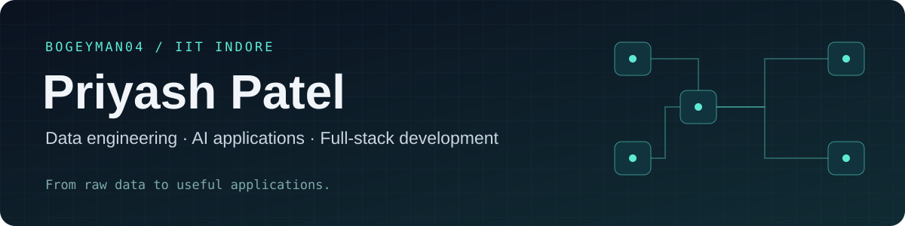

  

  
  
  
  

## Hey, I'm Priyash 👋

I'm a **Civil Engineering undergraduate at IIT Indore** who builds data pipelines, AI applications and full-stack products. I'm also a **LeetCoder who loves solving problems**, a **photographer, cinematographer and editor**.

- 📊 **Working with data at scale:** my Zomato project uses a source dataset with **35.1 million records**, including **10 million orders**.
- 🧩 **Problem solving:** I enjoy breaking down tricky problems and finding better solutions. I've solved 200+ DSA problems across LeetCode and Codeforces—[find me on LeetCode](https://leetcode.com/u/BoGeYmAn13/).
- 📷 **Photography:** I love capturing moments and telling stories through photographs.
- 🎬 **Cinematography and editing:** I enjoy shaping a story through composition, motion and the edit.

## Tools I work with

**Languages**

**Data and AI**

**Applications and infrastructure**

**Photography, video and design**

  &nbsp;&nbsp;
  &nbsp;&nbsp;
  &nbsp;&nbsp;
  

Photoshop · Premiere Pro · Lightroom · After Effects

## GitHub activity 📈

My contribution activity over the last 31 days.

<picture>
  <source media="(prefers-color-scheme: dark)" srcset="https://github-readme-activity-graph.vercel.app/graph?username=BoGeYmAn04&amp;days=31&amp;bg_color=0b1220&amp;color=cbd5e1&amp;line=5eead4&amp;point=f1f5f9&amp;area=true&amp;area_color=134e4a&amp;hide_border=true" />
  <source media="(prefers-color-scheme: light)" srcset="https://github-readme-activity-graph.vercel.app/graph?username=BoGeYmAn04&amp;days=31&amp;bg_color=ffffff&amp;color=334155&amp;line=059669&amp;point=0f766e&amp;area=true&amp;area_color=d1fae5&amp;hide_border=true" />
  
</picture>

Graph powered by <a href="https://github.com/ashutosh00710/github-readme-activity-graph">GitHub Readme Activity Graph</a>.

## A snake through my contributions 🐍

An animated tour of my GitHub contribution calendar, refreshed daily with GitHub Actions.

<picture>
  <source media="(prefers-color-scheme: dark)" srcset="https://raw.githubusercontent.com/BoGeYmAn04/BoGeYmAn04/output/github-snake-dark.svg" />
  <source media="(prefers-color-scheme: light)" srcset="https://raw.githubusercontent.com/BoGeYmAn04/BoGeYmAn04/output/github-snake.svg" />
  
</picture>

Animation generated with <a href="https://github.com/Platane/snk">Platane/snk</a>.

